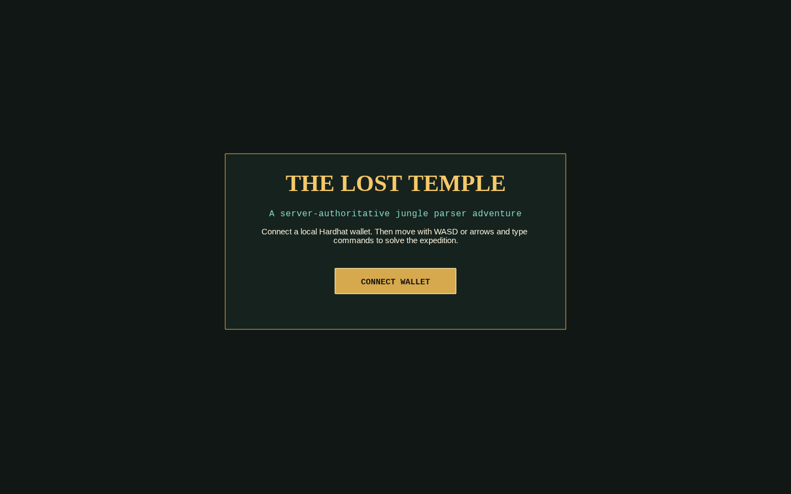
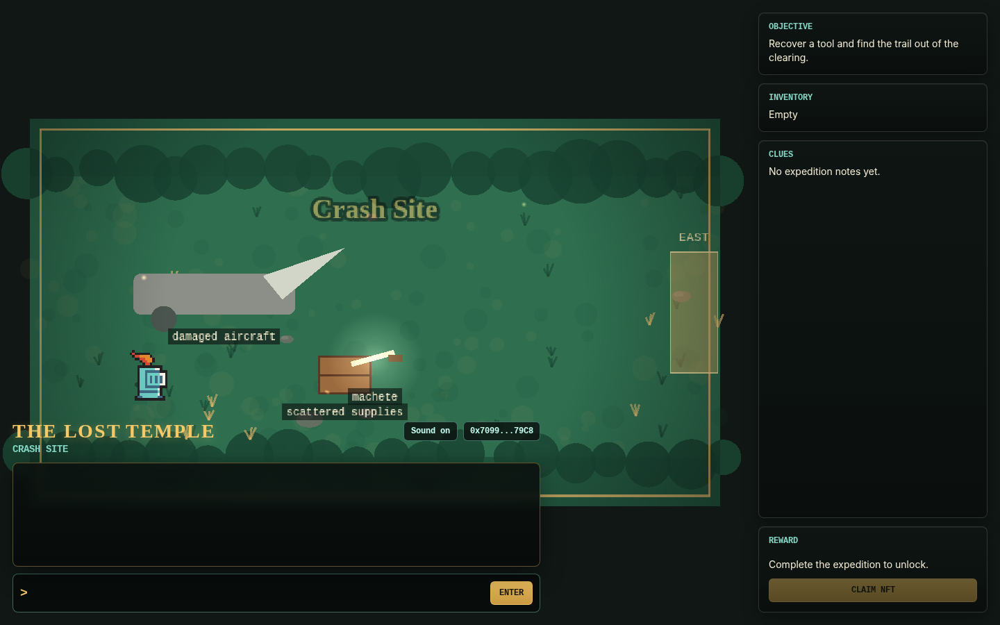
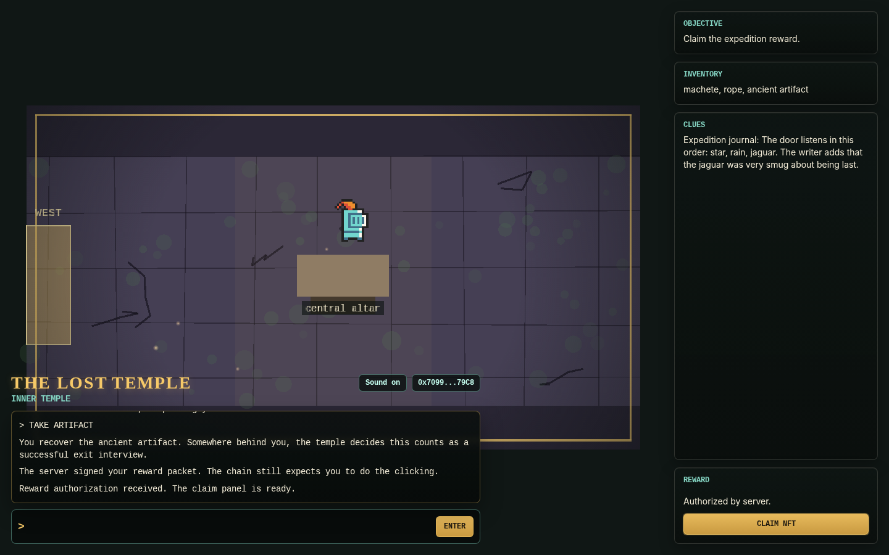
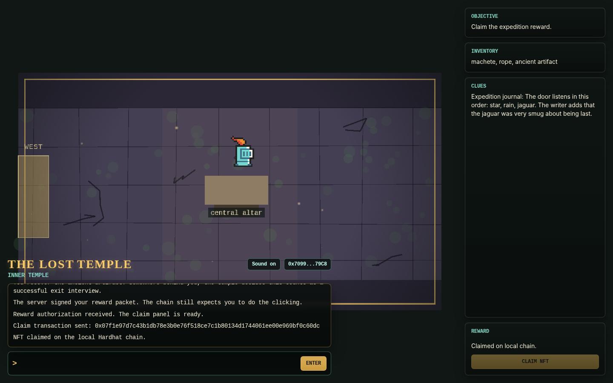
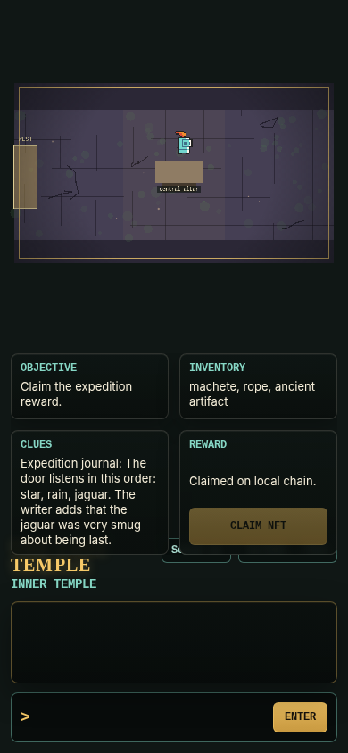
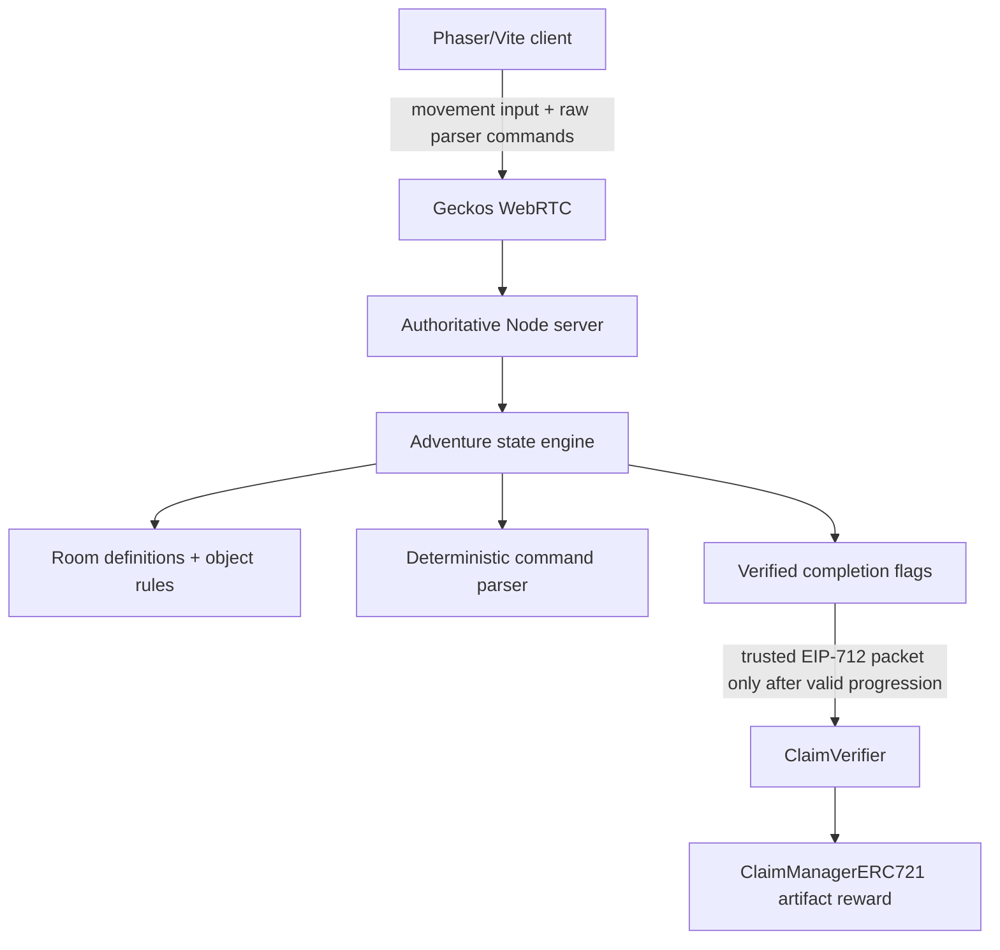

# The Lost Temple

The Lost Temple is a six-room, server-authoritative graphical parser adventure built from a sanitized blockchain game starter. It combines early-1990s adventure-game interaction patterns with a modern local WebRTC server and a Trustus-style blockchain reward claim.

The player is a stranded expedition engineer who must recover a machete, cut through jungle vines, repair a river crossing, read an abandoned journal, solve a temple glyph puzzle, recover an artifact, and then claim a locally authorized NFT reward.

Attribution: this assessment baseline is derived from the original `davideliasdev05/blockchain-game` starter repository. It was re-rooted from sanitized source rather than preserving the original Git history. See [SECURITY.md](SECURITY.md).

## Screenshots

Captured during local end-to-end QA against the localhost stack.











## Architecture



The client renders the world, captures movement, accepts typed commands, displays inventory/clues, and submits the final claim transaction. It does not decide inventory, room transitions, puzzle results, completion, or reward eligibility.

The server owns player state for each authenticated session:

- current room ID
- authoritative position
- inventory
- progression flags
- discovered clues
- temple glyph sequence
- completion and reward authorization state

## Security Model

Material gameplay actions are validated by the server. A modified client cannot set `artifactRecovered`, add inventory, teleport rooms, solve the puzzle, or request a reward by sending fabricated state. The server accepts raw movement and typed command strings, then derives every state transition from the authoritative room model and player position.

Reward authorization is only emitted after these server-owned flags are true:

- `macheteCollected`
- `vinesCut`
- `ropeCollected`
- `bridgeRepaired`
- `journalRead`
- `templePuzzleSolved`
- `artifactRecovered`
- `completed`

The Solidity contracts still verify that the reward packet was signed by the trusted local server signer. Local Hardhat accounts only are required. No real private keys, seed phrases, testnet funds, mainnet funds, or external RPC credentials are needed.

## Gameplay

Rooms use stable IDs rather than display strings:

1. `crash-site` - recover the machete near the damaged survey aircraft.
2. `jungle-trail` - cut obstructing vines with the machete.
3. `river-crossing` - collect rope and repair the bridge.
4. `abandoned-camp` - read the expedition journal and record the glyph clue.
5. `temple-entrance` - enter the three-symbol sequence on the glyph controls.
6. `inner-temple` - recover the artifact and unlock the server-authorized reward.

Movement uses WASD or arrow keys. Commands are typed into the command line and submitted with Enter. Useful commands include:

```text
LOOK
LOOK AT AIRCRAFT
TAKE MACHETE
USE MACHETE ON VINES
TAKE ROPE
USE ROPE ON BRIDGE
READ JOURNAL
USE STAR
INVENTORY
HELP
GO EAST
```

The parser accepts the same verbs the room objectives use, so `CLEAR VINES` and
`REPAIR BRIDGE` work as well as the `USE ... ON ...` forms, and the required item is
inferred when you do not name it. Other accepted phrasings:

```text
CUT / CLEAR / CHOP / SLASH / HACK <thing>     (with the machete)
REPAIR / FIX / MEND / TIE / LASH <thing>      (with the rope)
LOOK <thing>   X <thing>   EXAMINE <thing>    (the "AT" is optional)
CHECK INVENTORY   INV   I   ITEMS
```

An unrecognised verb suggests the closest match, so a typo like `REED JOURNAL` replies
"Did you mean READ?" rather than a flat refusal.

### Sound

Every cue is synthesised in the browser with Web Audio; there are no audio files in the
repository. Footsteps while walking, a blade swish for the vines, woody knocks for the
bridge, a bell for the journal, glyph tones that rise in pitch as the sequence builds
and buzz on a reset, a stone rumble for the door, an arpeggio for the artifact and the
claim, and a short low blip when an action is refused.

Which cue plays is decided from the authoritative state transition rather than by
matching on message text (`commons/adventure/sounds.mjs`), so rewording a reply cannot
silently drop its sound. A refusal is the one exception, since it has no state change
to read.

Sound can be toggled from the HUD button, and the preference persists per browser. The
audio context stays suspended until the first interaction, per browser autoplay rules,
and the whole layer is best-effort: a browser without Web Audio, or a headless run with
no output device, plays nothing and the game is unaffected.

## Local Runtime

Use Node `20.20.2` and npm `10.8.2`. The legacy Geckos/WebRTC path depends on `node-datachannel@0.4.3`, which did not install cleanly under Node 22 in this environment.

If you have the isolated runtime used during validation:

```bash
export PATH="$HOME/Tools/node-v20.20.2-linux-x64/bin:$PATH"
node --version
npm --version
node -p "process.versions.modules"
```

Expected:

```text
v20.20.2
10.8.2
115
```

## Install

Install dependencies explicitly from the repository root:

```bash
npm run install:contracts
npm run install:server
npm run install:client
```

This project standardizes on npm. Do not use pnpm workspace commands for this assessment.

## Run

Run each service in a separate terminal from the repository root.

Start the local Hardhat chain:

```bash
npm run node
```

Deploy the reward contracts:

```bash
npm run deploy
```

Start the authoritative game server:

```bash
npm run server
```

Start the Vite client:

```bash
npm run client
```

Open:

```text
http://localhost:3000
```

Use a browser wallet connected to local Hardhat chain ID `31337`. Import or use only Hardhat development accounts.

## Tests

Continuous integration runs all three of the following on every push and pull request
(`.github/workflows/ci.yml`).

Parser, progression, anti-cheat, auth, and persistence tests. These need only
`npm run install:server` and pass on a clean checkout; the chain-dependent claim test
skips itself:

```bash
npm test
```

Contract tests for the reward claim trust boundary — the claim-verifier-only gate,
receiver binding, the claim-manager registry, replay protection, packet expiry and
request mismatch, and the owner-only setters that hold the trust root:

```bash
npm run compile --prefix contracts
npm run test:contracts
```

These sign their packets with the same EIP-712 definition the server uses
(`commons/trustus.mjs`), so a drift between that and `Trustus.sol` fails here rather
than silently reverting every real claim.

Client typecheck. `vite build` does not typecheck, so this is a separate step:

```bash
npm run typecheck
```

Run the local blockchain reward integration test against a live chain, after Hardhat is
running and contracts are deployed:

```bash
npm run test:blockchain
```

Build the production client bundle:

```bash
npm run build --prefix client
```

### Room preview harness

With the Vite dev server running, open `http://localhost:3000/preview.html` to render any room in `MainScene` against a stub channel and fabricated state - no wallet, game server, or chain required. Useful for art iteration and screenshots. Query parameters:

```text
/preview.html?room=river-crossing&flags=macheteCollected,vinesCut&inventory=machete
```

The harness is dev-only; `preview.html` is not part of the production build.

### End-to-end screenshot harness

`scripts/e2e-screenshots.mjs` plays the entire adventure in headless Chrome with a scripted local Hardhat wallet: it connects, signs the EIP-712 auth challenge, walks all six rooms, solves the glyph puzzle, receives the server-signed reward packet, claims the NFT on the local chain, verifies the on-chain balance, and recaptures every readme screenshot (including the mobile layout via a reconnect). With the full stack running (`npm run node`, `npm run deploy`, `npm run server`, `npm run client`) and a fresh game-server session:

```bash
npm run install:e2e
npm run e2e:screenshots
```

It needs a local Chrome/Chromium (`CHROME_BIN` to override) and uses Hardhat development account #1 as the player.

"Fresh game-server session" matters: state persistence restores completed progress, so delete `server/data/player-states.json` between runs or the harness times out waiting for the opening room.

The harness introspects scene state through a `window.__LOST_TEMPLE_GAME__` hook that a normal production build strips. To exercise the built bundle rather than the dev server, build in the dedicated mode, serve it, and point the harness at it:

```bash
npm run client:build:e2e
npm run client:preview
CLIENT_URL=http://localhost:4173 npm run e2e:screenshots
```

`npm run client:build:e2e` is an ordinary production build with `__E2E_HOOK__` defined; only that mode exposes the hook, so a normal `npm run build` never ships it.

## Project Structure

```text
commons/adventure/        Shared parser schema, command parser, room definitions
server/auth.js            Testable local challenge/signature authorization helpers
server/persistence.js     File-backed player state store with debounced atomic writes
server/game/adventure/    Server-owned state and authoritative action engine
server/game/scenes/       Headless Phaser authoritative session scene
client/src/scenes/        Wallet connection, Geckos connection, rendered adventure UI
contracts/src/            ClaimVerifier and ClaimManagerERC721 Solidity contracts
contracts/test/           Hardhat coverage for the reward claim trust boundary
commons/trustus.mjs       Shared EIP-712 reward-packet domain and types
commons/adventure/sounds.mjs  Pure state-transition to sound-cue mapping
client/src/audio.ts       Web Audio synthesis for every sound cue
test/                     Node test-runner coverage for parser, progression, auth, rewards
scripts/                  Headless end-to-end gameplay, claim, and screenshot harness
.github/workflows/        CI: unit tests, client typecheck and build, contract tests
```

## Design Decisions

- The command parser returns structured intents; it does not mutate state.
- The action engine clones state, validates room/object/position/prerequisites, and returns structured results.
- The client displays server snapshots and result messages rather than making material decisions locally.
- The symbol puzzle is sequence-based and owned by server state.
- Repeated actions are idempotent or rejected without duplicating inventory/rewards.
- The blockchain reward path remains local and uses the existing Trustus verifier pattern.

## State Persistence

Player states survive server restarts. The server keeps authoritative state in a file-backed store (`server/persistence.js`) that loads `server/data/player-states.json` at startup, debounces atomic writes while play is in progress, and flushes on disconnect and shutdown. Set `STATE_FILE` to override the storage path. A corrupt state file is backed up to `player-states.json.corrupt` and the server starts fresh rather than crashing. Delete `server/data/` to reset all progress.

## Known Limitations

- Interactive play still requires a browser wallet configured for Hardhat localhost; the automated claim flow is covered by the end-to-end harness in `scripts/`.
- The legacy Vite 2 build still emits a single large chunk, dominated by Phaser and ethers v5; a Vite major upgrade and code splitting were intentionally deferred. Web3Modal was dropped in favour of a direct injected-provider request, since only injected wallets were ever supported, cutting the gzipped bundle by roughly a third.
- The art and audio are both fully procedural (layered scenery, particles, and lighting drawn in code; sound synthesised from oscillators and shaped noise) plus the starter knight sprite. There is no external sprite pack and no audio files, which keeps the repository asset-free but also keeps the palette simple.
- There is no ambient room audio, only discrete event cues, and no music.
- The parser is forgiving about verbs and unambiguous partial nouns, but it still has no hint system and no `EXITS`, `AGAIN`, `DROP`, `SEARCH`, or `MAP`. Ambiguous nouns are deliberately left unresolved rather than guessed, so `LOOK AT GLYPHS` with three glyphs present asks you to be specific.
- Test coverage is deliberately concentrated on the trust boundaries: the action engine, auth, persistence, and the claim contracts. The session scene (`server/game/scenes/adventureScene.js`), the HTTP/Geckos wiring in `server/server.js`, movement collision, and the client scenes have no unit coverage; the client is exercised only by the end-to-end harness. Room data has no structural test, so a bad exit or object position would be caught by playing rather than by CI.

## Security Baseline

The starter repository contained unrelated unsafe remote-execution artifacts. They were removed before development, and the submitted repository was re-rooted from sanitized source. No malicious payloads are preserved in ordinary reachable Git history. See [SECURITY.md](SECURITY.md).
