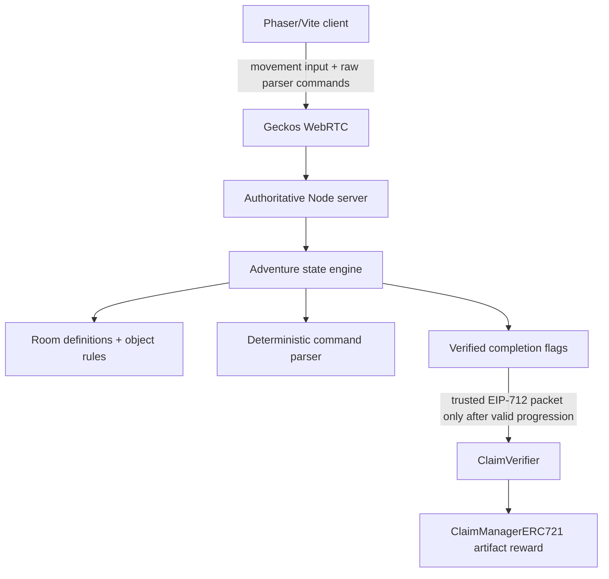

# The Lost Temple

The Lost Temple is a six-room, server-authoritative graphical parser adventure built from a sanitized blockchain game starter. It combines early-1990s adventure-game interaction patterns with a modern local WebRTC server and a Trustus-style blockchain reward claim.

The player is a stranded expedition engineer who must recover a machete, cut through jungle vines, repair a river crossing, read an abandoned journal, solve a temple glyph puzzle, recover an artifact, and then claim a locally authorized NFT reward.

Attribution: this assessment baseline is derived from the original `davideliasdev05/blockchain-game` starter repository. It was re-rooted from sanitized source rather than preserving the original Git history. See [SECURITY.md](SECURITY.md).

## Screenshots

Screenshots are intentionally left as a publication step after final manual playtest. The running client is available at `http://localhost:3000` during local validation.

## Architecture



The client renders the world, captures movement, accepts typed commands, displays inventory/clues, and submits the final claim transaction. It does not decide inventory, room transitions, puzzle results, completion, or reward eligibility.

The server owns player state for each authenticated session:

- current room ID
- authoritative position
- inventory
- progression flags
- discovered clues
- temple glyph sequence
- completion and reward authorization state

## Security Model

Material gameplay actions are validated by the server. A modified client cannot set `artifactRecovered`, add inventory, teleport rooms, solve the puzzle, or request a reward by sending fabricated state. The server accepts raw movement and typed command strings, then derives every state transition from the authoritative room model and player position.

Reward authorization is only emitted after these server-owned flags are true:

- `macheteCollected`
- `vinesCut`
- `ropeCollected`
- `bridgeRepaired`
- `journalRead`
- `templePuzzleSolved`
- `artifactRecovered`
- `completed`

The Solidity contracts still verify that the reward packet was signed by the trusted local server signer. Local Hardhat accounts only are required. No real private keys, seed phrases, testnet funds, mainnet funds, or external RPC credentials are needed.

## Gameplay

Rooms use stable IDs rather than display strings:

1. `crash-site` - recover the machete near the damaged survey aircraft.
2. `jungle-trail` - cut obstructing vines with the machete.
3. `river-crossing` - collect rope and repair the bridge.
4. `abandoned-camp` - read the expedition journal and record the glyph clue.
5. `temple-entrance` - enter the three-symbol sequence on the glyph controls.
6. `inner-temple` - recover the artifact and unlock the server-authorized reward.

Movement uses WASD or arrow keys. Commands are typed into the command line and submitted with Enter. Useful commands include:

```text
LOOK
LOOK AT AIRCRAFT
TAKE MACHETE
USE MACHETE ON VINES
TAKE ROPE
USE ROPE ON BRIDGE
READ JOURNAL
USE STAR
INVENTORY
HELP
GO EAST
```

## Local Runtime

Use Node `20.20.2` and npm `10.8.2`. The legacy Geckos/WebRTC path depends on `node-datachannel@0.4.3`, which did not install cleanly under Node 22 in this environment.

If you have the isolated runtime used during validation:

```bash
export PATH="$HOME/Tools/node-v20.20.2-linux-x64/bin:$PATH"
node --version
npm --version
node -p "process.versions.modules"
```

Expected:

```text
v20.20.2
10.8.2
115
```

## Install

Install dependencies explicitly from the repository root:

```bash
npm run install:contracts
npm run install:server
npm run install:client
```

This project standardizes on npm. Do not use pnpm workspace commands for this assessment.

## Run

Run each service in a separate terminal from the repository root.

Start the local Hardhat chain:

```bash
npm run node
```

Deploy the reward contracts:

```bash
npm run deploy
```

Start the authoritative game server:

```bash
npm run server
```

Start the Vite client:

```bash
npm run client
```

Open:

```text
http://localhost:3000
```

Use a browser wallet connected to local Hardhat chain ID `31337`. Import or use only Hardhat development accounts.

## Tests

Run parser, progression, anti-cheat, and auth tests:

```bash
npm test
```

Run the local blockchain reward integration test after Hardhat is running and contracts are deployed:

```bash
npm run test:blockchain
```

Compile contracts:

```bash
npm run compile --prefix contracts
```

Build the production client bundle:

```bash
npm run build --prefix client
```

## Project Structure

```text
commons/adventure/        Shared parser schema, command parser, room definitions
server/auth.js            Testable local challenge/signature authorization helpers
server/game/adventure/    Server-owned state and authoritative action engine
server/game/scenes/       Headless Phaser authoritative session scene
client/src/scenes/        Wallet connection, Geckos connection, rendered adventure UI
contracts/src/            ClaimVerifier and ClaimManagerERC721 Solidity contracts
test/                     Node test-runner coverage for parser, progression, auth, rewards
```

## Design Decisions

- The command parser returns structured intents; it does not mutate state.
- The action engine clones state, validates room/object/position/prerequisites, and returns structured results.
- The client displays server snapshots and result messages rather than making material decisions locally.
- The symbol puzzle is sequence-based and owned by server state.
- Repeated actions are idempotent or rejected without duplicating inventory/rewards.
- The blockchain reward path remains local and uses the existing Trustus verifier pattern.

## Known Limitations

- State persistence is in memory for the running server process only.
- Manual wallet UI testing still requires a browser wallet configured for Hardhat localhost.
- The Vite/Web3Modal legacy dependency stack produces a large production bundle; major upgrades were intentionally deferred.
- The current art direction uses procedural Phaser primitives and the starter knight sprite rather than a full custom sprite pack.

## Security Baseline

The starter repository contained unrelated unsafe remote-execution artifacts. They were removed before development, and the submitted repository was re-rooted from sanitized source. No malicious payloads are preserved in ordinary reachable Git history. See [SECURITY.md](SECURITY.md).
